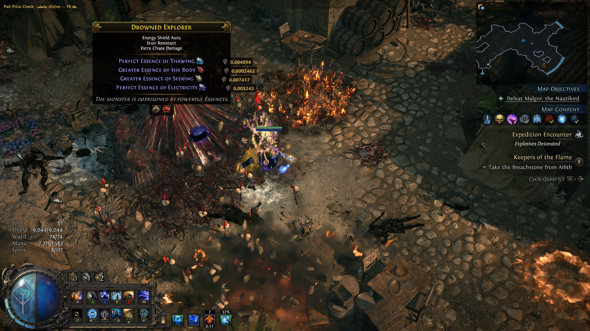
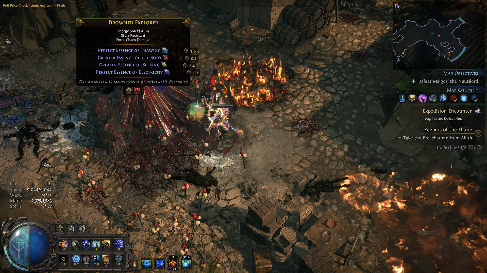
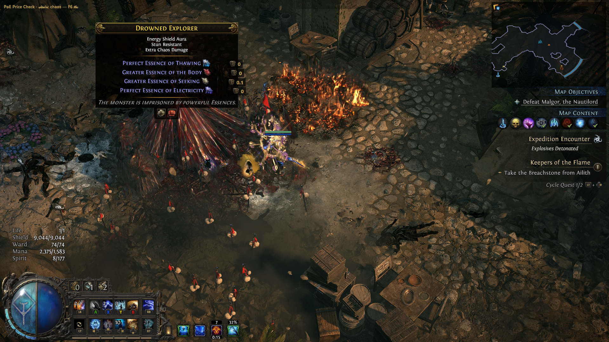
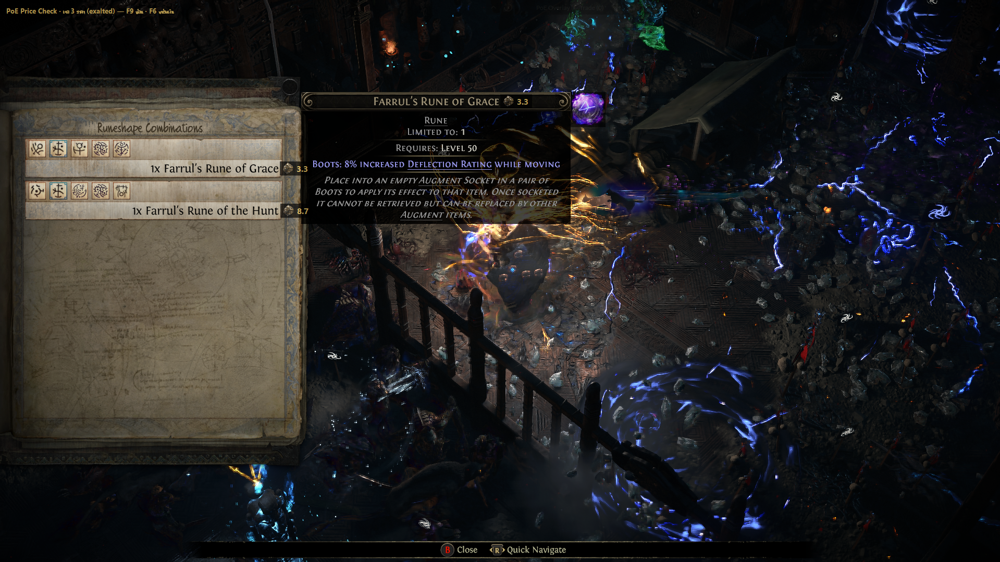
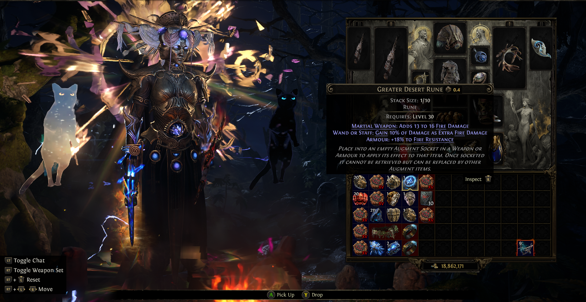
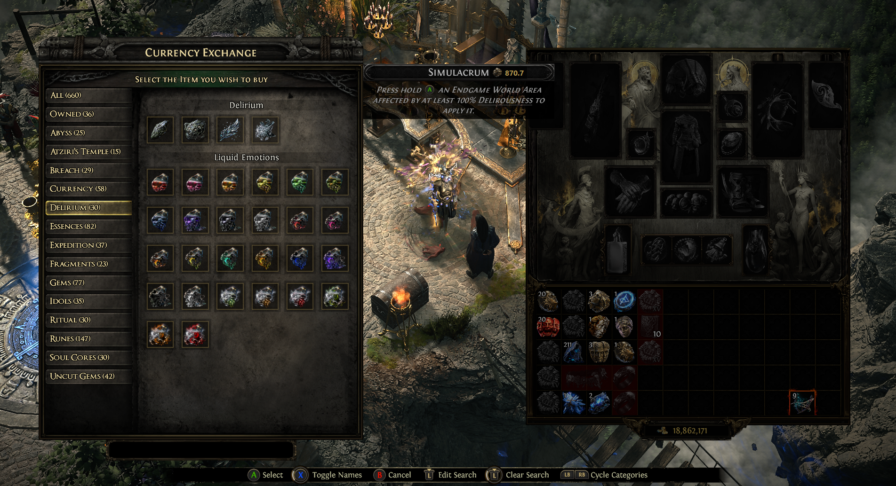
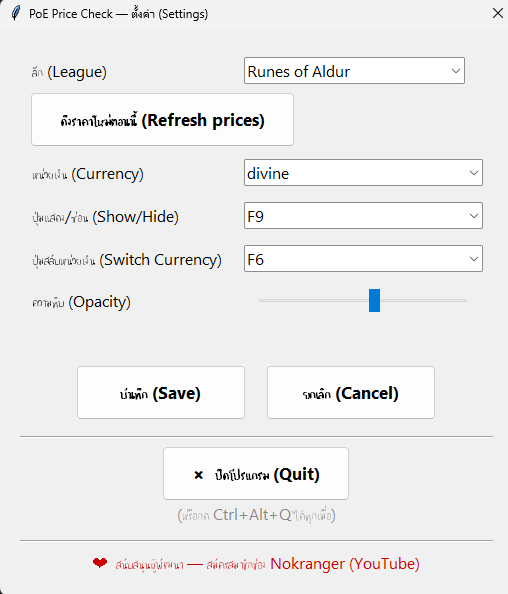
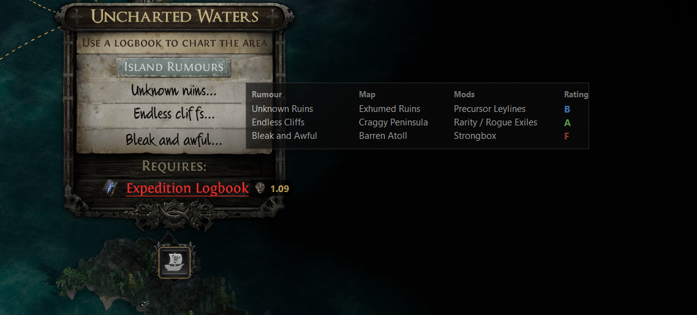

# PoE Price Check

ตัวช่วยเช็คราคา currency / รางวัล / alloy ของ **Path of Exile 2** — อ่านรายการของบนหน้าจอ
ด้วย OCR แล้วโชว์ราคาจาก poe.ninja ทับไว้ข้าง ๆ ของแต่ละชิ้น

- **price core** (ดึงราคา + fuzzy match): ไม่มี dependency เลย ใช้ stdlib ล้วน
- **OCR** (อ่านหน้าจอ): จับภาพด้วย ctypes + ใช้ **Windows OCR ในตัว Windows** (ไม่ต้องลง engine แยก)
- **overlay**: tkinter + ctypes — โปร่งแสง คลิกทะลุ มี hotkey + หน้า Settings

> 🔒 ปลอดภัยทั้งต่อเครื่องและต่อบัญชีเกม — อ่าน [SECURITY.md](SECURITY.md)
> (อ่านหน้าจออย่างเดียว ไม่ยุ่งกับหน่วยความจำ/ไฟล์/เครือข่ายของเกม)

[](https://www.youtube.com/c/NokrangerChannel/join)

ของฟรี 100% — ถ้าชอบและอยากสนับสนุนการพัฒนา **สมัครสมาชิกช่อง [Nokranger บน YouTube](https://www.youtube.com/c/NokrangerChannel/join)** ได้ (ไม่บังคับ ทุกฟีเจอร์ใช้ได้ฟรีเสมอ) 🙏

---

## ภาพตัวอย่าง (Screenshots)

ราคาโผล่ข้างของแต่ละชิ้น — กด **F6** สลับหน่วยเงินได้สด ๆ:

| divine | exalted | chaos |
|:---:|:---:|:---:|
|  |  |  |

ใช้ได้กับหลาย panel — Runeshape Combinations, ช่องเก็บของ, Currency Exchange ฯลฯ
(ขอแค่ OCR อ่านชื่อไอเทมออก + ไอเทมอยู่ในหมวดที่ดึง ก็ตีราคาได้):

| Expedition | ช่องเก็บของ | Currency Exchange |
|:---:|:---:|:---:|
|  |  |  |

หน้าตั้งค่า (กด F8) — เลือกลีก / หน่วยเงิน / ปุ่มลัด / ความทึบ / ปิดโปรแกรม:



**ใหม่ (v0.1.6) — เช็คข่าวลือ Expedition (Island Rumours):** เอาเมาส์ชี้ **Expedition Logbook**
ให้ข่าวลือโชว์ → กด **F9** → ตารางบอกว่าแต่ละข่าวลือไป **แมพไหน / มอดเด่นอะไร / เทียร์ความคุ้ม**
(สีตามเทียร์ S–F) รองรับครบทั้ง 19 ข่าวลือ:



---

# วิธีใช้งาน — เลือกได้ 2 แบบ

> ⚠️ **ก่อนใช้ทุกแบบ:** ตั้งเกมเป็นโหมด **Windowed** หรือ **Borderless** (ห้าม Exclusive Fullscreen)
> ไม่งั้นจับภาพหน้าจอไม่ได้ (ได้จอดำ) และ overlay จะไม่ขึ้น

### ⚡ วิธีใช้แบบเร็ว (4 ขั้นตอน)
1. ตั้งเกมเป็น **Windowed / Borderless**
2. เปิดโปรแกรม รอมุมซ้ายบนขึ้น **"พร้อม! ได้ราคา…"**
3. ในเกมเปิดหน้าต่างของ / ค่าเงิน / รางวัล
4. กด **F9** → ราคาโผล่ข้างของ (กดอีกครั้ง = ซ่อน) · **F6** สลับหน่วยเงิน · **F8** ตั้งค่า

> 💡 ในโปรแกรมมีปุ่ม **"📖 วิธีใช้งาน"** (กด F8 → ปุ่มบนสุด) อธิบายเป็นภาษาไทยให้ในตัว

## แบบที่ 1 — ไฟล์ .exe (ง่ายสุด สำหรับผู้ใช้ทั่วไป)

เหมาะกับคนที่อยากใช้เลย ไม่ต้องลงอะไร

1. โหลด **`PoE Price Check.exe`** จากหน้า [Releases](https://github.com/nokranger/poe-price-check/releases/latest) (ไฟล์เดียว ~13 MB)
2. **ดับเบิลคลิก** เปิดได้เลย — ไม่ต้องลง Python, ไม่มีหน้าต่าง cmd
   - ครั้งแรก Windows SmartScreen อาจเตือน "Unknown publisher" → กด **More info → Run anyway**
   - แอนตี้ไวรัสบางตัวอาจเตือน (false positive ของไฟล์ PyInstaller ที่ไม่ได้เซ็น) → อนุญาตได้
3. เข้าเกม เปิดหน้าต่างของ/ค่าเงิน แล้วกด **F9** ราคาจะโผล่ข้างของแต่ละชิ้น

## แบบที่ 2 — รันจาก source (สำหรับสายเทค / อยากตรวจสอบโค้ดเอง)

เหมาะกับคนที่อยากอ่าน/แก้โค้ด หรือไม่อยากเชื่อใจไฟล์ .exe ของคนอื่น

**สิ่งที่ต้องมี:** Windows 10/11 + Python 3.13

```bash
# 1. โหลดโค้ด (git clone หรือ Download ZIP จาก GitHub)
git clone <repo-url>
cd POE

# 2. ติดตั้ง dependency (winrt สำหรับ OCR — price core เฉย ๆ ไม่ต้องลงอะไร)
py -m pip install -r requirements.txt

# 3. เปิดโปรแกรมเต็ม (overlay)
py run.py
```

รันจาก source ได้ **เครื่องมือ terminal เพิ่ม** ที่ exe ไม่มี:

```bash
# เช็คราคาในเทอร์มินัลล้วน (ไม่ต้องเปิด overlay)
py -m poe_price "Runes of Aldur" -s "Divine Orb"
py -m poe_price "Runes of Aldur" --top 20          # โชว์ 20 อันดับแพงสุด

# จับภาพหน้าจอ -> อ่านราคา แสดงใน terminal
py -m poe_price.scan "Runes of Aldur"

# ทดสอบว่า OCR ใช้ได้
py run.py --selftest        # ต้องขึ้น "SELFTEST OK"
```

### build เป็น .exe เอง (จาก source)

อยากได้ .exe ไว้ใช้/แจกเอง — **ดับเบิลคลิก [`build.bat`](build.bat)** (หรือคำสั่งข้างล่าง)
ได้ไฟล์ `dist\PoE Price Check.exe`

```bash
py -m pip install pyinstaller
py -m PyInstaller --onefile --windowed --name "PoE Price Check" ^
  --add-data "img;img" --collect-all winrt --collect-submodules poe_price run.py
```

- `--windowed` = ไม่มีหน้าต่าง cmd (log ไปที่ `%LOCALAPPDATA%\PoePriceHelper\log.txt`)
- `--collect-all winrt` = ฝัง Windows OCR binding (จำเป็น ไม่งั้น OCR พังในไฟล์ .exe)
- build จาก `run.py` (ไม่ใช่ `poe_price/app.py` ตรง ๆ — ไม่งั้น relative import พัง)

**โดน antivirus เตือน?** เป็น false positive ของ PyInstaller (ไฟล์ใหม่ + ไม่ได้เซ็น) ลดได้โดย
ใช้ **[`build-onedir.bat`](build-onedir.bat)** แทน — build แบบ `--onedir` แล้ว zip (`dist\PoE-Price-Check.zip`)
โดนแฟลกน้อยกว่า `--onefile` มาก (เพราะไม่แตกไฟล์ลง temp ตอนรัน) + สร้าง SHA256 ให้ผู้ใช้ตรวจสอบด้วย.
แก้เพิ่ม: รายงาน false positive ที่ microsoft.com/wdsi/filesubmission, หรือเซ็นโค้ดฟรีผ่าน SignPath (OSS)

---

# ปุ่มลัด & การตั้งค่า

| ปุ่ม | ทำอะไร |
|------|--------|
| **F9** | แสดง/ซ่อนราคา (อ่านครั้งเดียว ค้างไว้ ไม่กะพริบ — เลื่อน/เปลี่ยนของแล้วกด F9 ใหม่) |
| **F6** | สลับหน่วยเงิน: divine → exalted → chaos |
| **F8** | เปิดหน้า **ตั้งค่า** (ลีก / หน่วยเงิน / ปุ่มลัด / ความทึบ / ดึงราคาใหม่) |
| **Ctrl+Alt+Q** | ออก |

> F9/F6 เปลี่ยนได้ในหน้า Settings (F8 ตายตัว). สแกน **ทั้งจอ** เสมอ ไม่ต้องเลือกพื้นที่

**ราคา (cache):** ดึงอัตโนมัติตั้งแต่ **เปิดโปรแกรม** — รอ status มุมซ้ายบนขึ้น
**"พร้อม! ได้ราคา N รายการ"** สักครู่ (ครั้งแรกใช้เวลานิดนึง) จากนั้นรีเฟรชเองทุก 30 นาที
→ **ปกติไม่ต้องกด refresh เอง**

ต้องกด refresh เองเฉพาะตอน: status ขึ้น **"ดึงราคาไม่ได้"** (เน็ตมีปัญหาตอนเปิด) หรืออยาก
ได้ราคาล่าสุดทันทีไม่รอ 30 นาที → กด **F8 → "ดึงราคาใหม่ตอนนี้"** → กด F9 อ่านใหม่

**ลีก:** ดีฟอลต์ "Runes of Aldur". ลีกเปลี่ยนเมื่อไหร่ ไปแก้ในหน้า Settings (F8) ได้เลย
**ไม่ต้องโหลดโปรแกรมใหม่** (ใส่ชื่อให้ตรงกับแถบเลือกลีกบน poe.ninja/poe2)

## หมวดที่เช็คราคาได้ (14 หมวด)

Currency · Fragments · Uncut Gems · Lineage Support Gems · Essences · Soul Cores ·
Idols · Runes · Expedition · **Verisium** (รวม Alloy) · **Omens** · **Abyssal Bones** ·
**Breach Catalysts** · **Liquid Emotions**

> ของในหมวดพวกนี้ ถ้า OCR อ่านชื่อออก = เช็คราคาได้
> **ยังไม่รองรับ:** Unique items, Tablets, Atziri's Temple, เจมตัด (Gems) — ใช้ API คนละ endpoint

---

# สำหรับนักพัฒนา

## โครงสร้าง

```
poe_price/
  models.py      โครงข้อมูล PriceEntry / PriceSnapshot
  normalizer.py  ปรับชื่อให้เป็นมาตรฐาน (API กับ OCR match กันได้)
  client.py      ยิง poe.ninja PoE2 exchange API + parse JSON
  matcher.py     fuzzy matching: gem -> exact -> prefix -> fuzzy (Levenshtein)
  repository.py  cache + auto-refresh 30 นาที + ค้นราคา (get / match)
  capture.py     จับภาพหน้าจอด้วย ctypes ล้วน
  ocr/           อ่านข้อความจากภาพ (pluggable engine: base.py + windows_ocr.py)
  scan.py        รวม capture + OCR + match
  config.py      เก็บค่าตั้งค่า (JSON ที่ %LOCALAPPDATA%\PoePriceHelper)
  overlay.py     หน้าต่างโปร่งแสง คลิกทะลุ วาดราคา (tkinter + ctypes)
  hotkeys.py     global hotkey (RegisterHotKey, ctypes)
  settings.py    หน้าต่างตั้งค่า (ttk)
  app.py         ตัวโปรแกรมหลัก (overlay + hotkey + worker)
  __main__.py    CLI เช็คราคา
run.py           entry point (สำหรับ build .exe)
tests/           เทสต์ offline (ไม่ยิงเน็ต/ไม่แตะหน้าจอ)
```

## ใช้เป็น library

```python
from poe_price import PriceRepository

repo = PriceRepository(league="Runes of Aldur")
repo.fetch()
entry = repo.get("Divine Orb")          # exact -> PriceEntry | None
result = repo.match("divlne orb")       # fuzzy: ทนชื่อเพี้ยน (สำหรับ OCR)
if result.matched():
    print(result.key, result.entry.divine_value, result.entry.chaos_value)
```

## รันเทสต์

```bash
py -m unittest discover -s tests -v
```

## API & การจับคู่ราคา

`GET https://poe.ninja/poe2/api/economy/exchange/current/overview?league=<ลีก>&type=<หมวด>`

ดึง 14 หมวด (type ภายในบางตัวไม่ตรง slug): `Currency`, `Fragments`, `UncutGems`,
`LineageSupportGems`, `Essences`, `SoulCores`, `Idols`, `Runes`, `Expedition`,
`Verisium`, `Ritual`, `Abyss`, `Breach`, `Delirium`. ราคาแปลงเป็น divine /
exalted / chaos ผ่าน `core.rates`. การจับคู่ชื่อ: gem (ปักหมุดชนิด+เลเวล) → exact →
prefix (≥10 ตัว) → fuzzy Levenshtein (>0.84) + แก้ OCR อ่านเลขเพี้ยน (1↔l/I) ใน parse_quantity

---

# เครดิต & ข้อมูลราคา (Credits)

ข้อมูลราคาทั้งหมดมาจาก **[poe.ninja](https://poe.ninja/poe2)** — ขอบคุณที่ทำข้อมูลเศรษฐกิจ
PoE2 ให้ชุมชนใช้ฟรี 🙏 โปรแกรมนี้ดึงข้อมูลแบบ **เบามือ** (cache + รีเฟรชทุก 30 นาที,
อ่านอย่างเดียว ไม่ redistribute) โปรแกรมนี้ไม่ได้สังกัด poe.ninja หรือ Grinding Gear Games

# สนับสนุน (Support)

โปรแกรมนี้ฟรีและโอเพนซอร์สเต็มตัว ไม่มีล็อกฟีเจอร์ ไม่มีโฆษณา
ถ้าอยากสนับสนุนให้พัฒนาต่อ → **สมัครสมาชิกช่อง [Nokranger (YouTube)](https://www.youtube.com/c/NokrangerChannel/join)** 🙏
(หรือกดได้จากในแอป: หน้า Settings → ปุ่ม F8)

# License

[MIT License](LICENSE) © Nokranger

โอเพนซอร์ส ใช้/แก้/แจกต่อได้อย่างอิสระ
